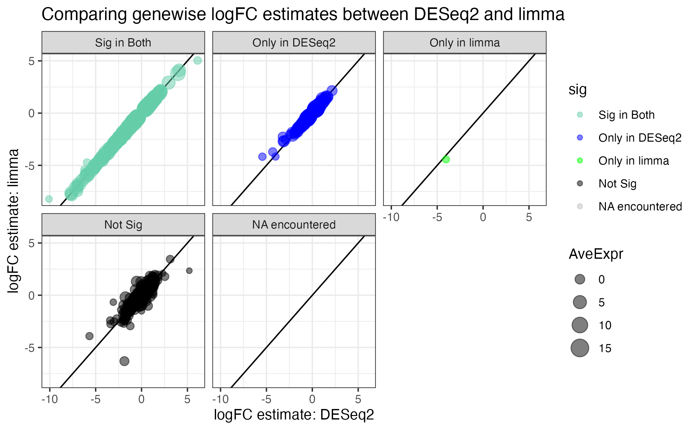

last updated: `r Sys.Date()`

# 

*What is `limmavoom`?*

-   `limma` is the original package used for differential gene expression analysis, from which edgeR inherits
-   `limmavoom` adapts the micro-array method to RNA-seq data

*How is `limmavoom` different from `edgeR` and `DESeq2`?* - edgeR and DESeq2 use raw count data and model it with a negative binomial distribution - voom converts counts to log CPM (log transform force the data into a more normal distribution), and then applys the voom transformation (estimates a mean-variance relationship for each gene and generates a precision weight for each observation) - All

# Introduction

In this activity, we will see how to do differential expression analysis on the same yeast RNA-seq data using the other two widely used packages:

`DESeq2` -- which models count data using a negative binomial distribution.

`limma-voom` -- which transforms count data to log-CPM values and fits linear models.

We will:

-   Load and preprocess the count data.

-   Generate sample metadata.

-   Filter low count genes.

-   Run the DESeq2 and limma-voom pipelines.

-   Compare results between all three methods.

-   Answer questions to interpret and compare the outcomes.

# Setup

We start by setting our seed and loading the necessary packages. We use `pak` to load libraries we will use such as DESeq2, limma, edgeR, and others required for annotation, visualization, and table creation.

```{r}
knitr::opts_chunk$set(echo = TRUE)
set.seed(1492)
```

```{r}
#| message: false
#| warning: false
if (!require("pak")) install.packages("pak"); library(pak)

pak(c(
  "tidyverse", "knitr", "readr", "pander", "BiocManager",
  "dplyr", "stringr", "purrr", "reactable",
  "DESeq2", "limma", "edgeR", "statmod", "Glimma",
  "AnnotationDbi", "org.Sc.sgd.db", "ggVennDiagram", "GGally")
)

options(digits = 3)
```

```{r}
#| message: false
#| warning: false
library(DESeq2)
library(edgeR) # contains the limma package
library(org.Sc.sgd.db)
library(tidyverse)
library(reactable)
library(cowplot)
```

# Data Loading and Preprocessing

## Loading the Count Data

We load the gene count data (generated by Salmon) from GitHub. The row names are the gene IDs, and we clean the column names for clarity.

```{r}
counts <- readr::read_tsv(
  'https://github.com/clstacy/GenomicAnalysis/raw/main/Data/Msn24_EtOH/counts/salmon.gene_counts.merged.nonsubsamp.tsv',
  col_names = TRUE
) %>% 
  column_to_rownames("Name")

# Clean column names (remove everything after the first period.)
colnames(counts) <- stringr::str_split_fixed(colnames(counts), "\\.", n = 2)[, 1]
```

## Creating Sample Metadata

We define a metadata table that contains each sample's name, genotype, and treatment condition. In addition, we create a combined "Group" variable (Genotype.Condition) for use in the limma analysis.

```{r}
sample_metadata <- tribble(
  ~Sample,                      ~Genotype,    ~Condition,
  "YPS606_MSN24_ETOH_REP1_R1",   "msn24dd",   "EtOH",
  "YPS606_MSN24_ETOH_REP2_R1",   "msn24dd",   "EtOH",
  "YPS606_MSN24_ETOH_REP3_R1",   "msn24dd",   "EtOH",
  "YPS606_MSN24_ETOH_REP4_R1",   "msn24dd",   "EtOH",
  "YPS606_MSN24_MOCK_REP1_R1",   "msn24dd",   "unstressed",
  "YPS606_MSN24_MOCK_REP2_R1",   "msn24dd",   "unstressed",
  "YPS606_MSN24_MOCK_REP3_R1",   "msn24dd",   "unstressed",
  "YPS606_MSN24_MOCK_REP4_R1",   "msn24dd",   "unstressed",
  "YPS606_WT_ETOH_REP1_R1",      "WT",        "EtOH",
  "YPS606_WT_ETOH_REP2_R1",      "WT",        "EtOH",
  "YPS606_WT_ETOH_REP3_R1",      "WT",        "EtOH",
  "YPS606_WT_ETOH_REP4_R1",      "WT",        "EtOH",
  "YPS606_WT_MOCK_REP1_R1",      "WT",        "unstressed",
  "YPS606_WT_MOCK_REP2_R1",      "WT",        "unstressed",
  "YPS606_WT_MOCK_REP3_R1",      "WT",        "unstressed",
  "YPS606_WT_MOCK_REP4_R1",      "WT",        "unstressed"
) %>%
  mutate(
    Group = factor(
      paste(Genotype, Condition, sep = "."),
      levels = c("WT.unstressed", "WT.EtOH", "msn24dd.unstressed", "msn24dd.EtOH")
    ),
    Genotype = factor(Genotype, levels = c("WT", "msn24dd")),
    Condition = factor(Condition, levels = c("unstressed", "EtOH"))
  )

```

# Differential Expression Analysis with DESeq2

In the `DESeq2` pipeline, we

1.  construct a DESeqDataSet,

2.  filter low count genes,

3.  run the DESeq2 model,

4.  extract results, and

5.  visualize the findings.

## Constructing the DESeqDataSet

We create a dataset using the count matrix and sample metadata. The design includes main effects for genotype and condition plus their interaction.

```{r}
dds <- DESeqDataSetFromMatrix(
  countData = round(counts),
  colData = sample_metadata,
  #Design Matrix: Genotype, Condition, and Genotype *by* Condition
  design = ~ Genotype + Condition + Genotype:Condition
)

colnames(dds) <- str_split_fixed(colnames(dds), "\\.", n = 2)[, 1]
dds
```

**Note: see what happens if we don't `round()` the counts here in DESeq2**

## Filtering Low Count Genes

Why do we filter? Lets look at the distribution of normalized counts for each gene before and after filtering.

```{r}
preFilterCPMplot = counts(dds) |>
  edgeR::cpm(log=T) |>
  data.frame() |>
  rownames_to_column("ORF") |>
  pivot_longer(-ORF, names_to = "Sample", values_to = "CPM") |>
  left_join(sample_metadata, by = "Sample") |>
  ggplot(aes(x = CPM, group = Sample, color = Group)) +
  geom_density() +
  theme_minimal() +
  scale_y_continuous(labels = scales::percent, name = "percent") +
  theme(legend.position = "bottom") +
  guides(colour = guide_legend(nrow = 2)) +
  ggtitle("Distribution of log2(CPM) Before Filtering")

preFilterCPMplot
```

**Interpretation**: Median gene has a logCPM of around 5, but about 5-10% of genes in each sample have no or essentially no counts.

Next, we filter out genes that do not have at least 10 counts in at least four samples (the size of our smallest group).

```{r}
smallestGroupSize <- 4
keep <- rowSums(counts(dds) >= 10) >= smallestGroupSize
dds <- dds[keep, ]
```

```{r}
postFilterCPMplot = counts(dds) |>
  edgeR::cpm(log=T) |>
  data.frame() |>
  rownames_to_column("ORF") |>
  pivot_longer(-ORF, names_to = "Sample", values_to = "CPM") |>
  left_join(sample_metadata, by = "Sample") |>
  ggplot(aes(x = CPM, group = Sample, color = Group)) +
  geom_density() +
  theme_minimal() +
  scale_y_continuous(labels = scales::percent, name = "percent") +
  theme(legend.position = "bottom") +
  guides(colour = guide_legend(nrow = 2)) +
  ggtitle("Distribution of log2(CPM) After Filtering")

# Print CPM distribution plot before filtering

# Print CPM distribution plot after filtering
plot_grid(preFilterCPMplot, postFilterCPMplot, ncol = 2)
```

**Interpretation**: The filtered genes have a median CPM of 5, but the tail of genes with low/no expression is gone.

## Running the DESeq2 Analysis

Let's run the full DESeq2 workflow. Note that the default contrast here (the interaction term) compares the response to EtOH between mutant and WT strains.

```{r}
dds <- DESeq(dds)
resultsNames(dds)
```

## Extracting and Viewing Results

Extract the results for the interaction between genotype and pre-treatment, and then build a table that includes gene annotations.

```{r}
res_deseq2 <- results(dds, name = "Genotypemsn24dd.ConditionEtOH")
res_deseq2

## To see the results for another term, replace the name with an option above, e.g.:
# res_deseq2_stress <- results(dds, name = "Condition_EtOH_vs_unstressed")
```

Convert this object into a data frame and add gene annotations.

```{r}
res_deseq2 %>%
  data.frame() %>%
  rownames_to_column("ORF") %>%
  left_join(AnnotationDbi::select(org.Sc.sgd.db, 
                                  keys = .$ORF, 
                                  columns = "GENENAME"),
            by = "ORF") %>%
  relocate(GENENAME, .after = ORF) %>%
  arrange(padj) %>%
  mutate(log2FoldChange = round(log2FoldChange, 2)) %>%
  mutate(across(where(is.numeric), \(x) signif(x, 3))) %>%
  reactable()
```

## Visualization

We create an MA-plot to visualize the overall differential expression profile and plot counts for an individual gene.

```{r}
DESeq2::plotMA(res_deseq2, alpha = 0.01)
gene <- "YER091C"  # Example gene; change as needed
plotCounts(dds, gene = "YEL039C", intgroup = c("Genotype", "Condition"), 
           xlab = "Genotype:Condition")
```

**Interpretation**:

*Plot 1*: MA plot, x-axis depicts expression level, y-axis depicts log fold change

*Plot 2*: Picking out a specific gene, you can look at the normalized counts across conditions, and see the change from 10-fold induction to 50 fold induction (x5) and 1000 fold induction (x100) in the mutant groups.

## Saving DESeq2 Results

We save the DESeq2 results as a TSV file and as an R object.

```{r}
dir_output_DESeq2 <- path.expand("~/Documents/gda/Exercises/03_WorkingWithSequences/data/output/Analysis/DESeq2/")
if (!dir.exists(dir_output_DESeq2)) {
  dir.create(dir_output_DESeq2, recursive = TRUE)
}
res_deseq2 %>%
  data.frame() %>%
  rownames_to_column("ORF") %>%
  left_join(AnnotationDbi::select(org.Sc.sgd.db, keys = .$ORF, columns = "GENENAME"), by = "ORF") %>%
  relocate(GENENAME, .after = ORF) %>%
  write_tsv(file = paste0(dir_output_DESeq2, "yeast_res_DESeq2.tsv"))

saveRDS(object = res_deseq2, file = paste0(dir_output_DESeq2, "yeast_res_DESeq2.Rds"))
```

# Differential Expression Analysis with limma-voom

The `limma-voom` workflow: 1. Create a design matrix based on the combined "Group" variable, 2. then builds a DGEList object (like edgeR), 3. normalizes the data, 4. applies the voom transformation, 5. fits a linear model, and 6. test contrasts.

## Creating the Design Matrix

We use the "Group" factor from our sample metadata to construct the design matrix.

```{r}
group <- sample_metadata$Group
design <- model.matrix(~ 0 + group)
colnames(design) <- levels(group)
design
```

## Preparing the Data for limma

We create a DGEList from the count data and add gene annotations.

```{r}
y <- DGEList(counts, group = group)
colnames(y) <- sample_metadata$Sample
y$samples

# Add gene annotation information
y$genes <- AnnotationDbi::select(org.Sc.sgd.db, keys = rownames(y), columns = "GENENAME")
head(y$genes)
```

## Filtering Low Count Genes

We filter genes that are expressed at a CPM greater than 0.7 in at least four samples.

```{r}
keep <- rowSums(cpm(y) > 0.7) >= 4
y <- y[keep, ]
summary(keep)
```

## Normalization and Voom Transformation

We perform TMM normalization and then transform the counts using voom. (learn more: https://bioconductor.org/packages/release/workflows/vignettes/RNAseq123/inst/doc/limmaWorkflow.html)

```{r}
y <- calcNormFactors(y)
y <- voom(y, design, plot = TRUE)
```

**Interoretation**: Trended variance comparing log-counts (x) versus variance (y). Compare to `edgeR`, which uses raw counts.

## Fitting the Linear Model and Testing Contrasts

We fit a linear model with `lmFit` and then define contrasts. Here we create several contrasts; one of interest is the difference in the stress responses between mutant and WT strains.

```{r}
fit <- lmFit(y, design)

my.contrasts <- makeContrasts(
  EtOHvsMOCK.WT = `WT.EtOH` - `WT.unstressed`,
  EtOHvsMOCK.MSN24dd = `msn24dd.EtOH` - `msn24dd.unstressed`,
  EtOH.MSN24ddvsWT = `msn24dd.EtOH` - `WT.EtOH`,
  MOCK.MSN24ddvsWT = `msn24dd.unstressed` - `WT.unstressed`,
  EtOHvsWT.MSN24ddvsWT = (`msn24dd.EtOH` - `msn24dd.unstressed`) - 
    (`WT.EtOH` - `WT.unstressed`),
  levels = design
)

res_limma <- contrasts.fit(fit, my.contrasts)
res_limma <- eBayes(res_limma)
```

## Viewing Results Across Contrasts

We can generate a comprehensive table of results from all contrasts.

```{r}
top_table_limma <- topTable(res_limma, sort.by = "F", n = Inf)
head(top_table_limma, 20)

top_table_limma %>%
  as_tibble() %>%
  arrange(adj.P.Val) %>%
  mutate(across(where(is.numeric), \(x) signif(x, 3))) %>%
  reactable()
```

### Focusing on a Specific Contrast

Let’s focus on the interaction contrast (difference in the response to EtOH between mutant and WT).

```{r}
res_specific <- contrasts.fit(fit, my.contrasts[, "EtOHvsWT.MSN24ddvsWT"])
res_specific <- eBayes(res_specific)
top_table_specific <- topTable(res_specific, sort.by = "P", n = Inf)
head(top_table_specific, 20)

top_table_specific %>%
  as_tibble() %>%
  arrange(adj.P.Val) %>%
  mutate(across(where(is.numeric), \(x) signif(x, 3))) %>%
  reactable()

is.de <- decideTests(res_specific, p.value = 0.05)
summary(is.de)
```

## Visualization

Generate an MA-plot for the specific contrast.

```{r}
limma::plotMA(res_specific, status = is.de)
```

## Saving limma Results

We save the overall limma results, along with the specific contrast results.

```{r}
dir_output_limma <- path.expand("~/Documents/gda/Exercises/03_WorkingWithSequences/data/output/Analysis/limma/")
if (!dir.exists(dir_output_limma)) {
  dir.create(dir_output_limma, recursive = TRUE)
}

top_table_specific %>%
  as_tibble() %>%
  arrange(desc(adj.P.Val)) %>%
  mutate(adj.P.Val = round(adj.P.Val, 2)) %>%
  mutate(across(where(is.numeric), \(x) signif(x, 3))) %>%
  write_tsv(file = paste0(dir_output_limma, "yeast_topTags_limma.tsv"))

saveRDS(object = res_specific, file = paste0(dir_output_limma, "yeast_res_limma.Rds"))
saveRDS(object = y, file = paste0(dir_output_limma, "yeast_y_limma.Rds"))
```

# Comparison of DE Methods

We have went through some example DE workflows with `edgeR`, `DESeq2`, and `limma-voom`. Since we have saved our outputs for each analysis, we can compare their outcomes now.

```{r load-DEworkflows}
# load in all of the DE results for the difference of difference contrast
path_output_edgeR <- "~/Documents/gda/Exercises/03_WorkingWithSequences/data/output/edgeR/yeast_topTags_edgeR.tsv"
# The below path grabs that file from GitHub.
path_output_edgeR <- "https://github.com/clstacy/GenomicAnalysis/raw/main/Data/Msn24_EtOH/DE_genes/edgeR/yeast_topTags_edgeR.tsv"
path_output_DESeq2 <- "~/Documents/gda/Exercises/03_WorkingWithSequences/data/output/Analysis/DESeq2/yeast_res_DESeq2.tsv"
path_output_limma <- "~/Documents/gda/Exercises/03_WorkingWithSequences/data/output/Analysis/limma/yeast_topTags_limma.tsv"

topTags_edgeR <- readr::read_tsv(path_output_edgeR)
topTags_DESeq2 <- readr::read_tsv(path_output_DESeq2)
topTags_limma <- readr::read_tsv(path_output_limma)
```

```{r get-geneLists}
sig_cutoff <- 0.01
FC_cutoff <- 1
# NOTE: we need to be very careful applying an FC cutoff like this

## edgeR
# get genes that are upregualted
up_edgeR_DEG <- topTags_edgeR %>%
  dplyr::filter(FDR < sig_cutoff & logFC > FC_cutoff) %>%
  pull(ORF)

down_edgeR_DEG <- topTags_edgeR %>%
  dplyr::filter(FDR < sig_cutoff & logFC < -FC_cutoff) %>%
  pull(ORF)

## DESeq2
up_DESeq2_DEG <- topTags_DESeq2 %>%
  dplyr::filter(padj < sig_cutoff & log2FoldChange > FC_cutoff) %>%
  pull(ORF)

down_DESeq2_DEG <- topTags_DESeq2 %>%
  dplyr::filter(padj < sig_cutoff & log2FoldChange < -FC_cutoff) %>%
  pull(ORF)

## limma
up_limma_DEG <- topTags_limma %>%
  dplyr::filter(adj.P.Val < sig_cutoff & logFC > FC_cutoff) %>%
  pull(ORF)

down_limma_DEG <- topTags_limma %>%
  dplyr::filter(adj.P.Val < sig_cutoff & logFC < -FC_cutoff) %>%
  pull(ORF)

up_DEG_results_list <- list(up_edgeR_DEG,
                        up_DESeq2_DEG,
                        up_limma_DEG)

# visualize the GO results list as a venn diagram
ggVennDiagram::ggVennDiagram(up_DEG_results_list,
              category.names = c("edgeR", "DESeq2", "limma")) +
  scale_x_continuous(expand = expansion(mult = .2)) +
  scale_fill_distiller(palette = "RdBu"
  ) +
  ggtitle("Upregulated genes in contrast: \n(EtOH.MSN2/4dd - MOCK.MSN2/4dd) -\n (EtOH.WT - MOCK.WT)")


# Now let's do the same for downregulated genes:
down_DEG_results_list <- list(down_edgeR_DEG,
                        down_DESeq2_DEG,
                        down_limma_DEG)

ggVennDiagram::ggVennDiagram(down_DEG_results_list,
              category.names = c("edgeR", "DESeq2", "limma")) +
  scale_x_continuous(expand = expansion(mult = .2)) +
  scale_fill_distiller(palette = "RdBu"
  ) +
  ggtitle("Downregulated genes in contrast: \n(EtOH.MSN2/4dd - MOCK.MSN2/4dd) -\n (EtOH.WT - MOCK.WT)")
```

**Interpretation**: The code pulls every gene that is classified as up-regulated and down-regulated by `limma`, `edgeR`, and `DESeq2` and comparing the gene lists. The group picked for comparison was purposefully chosen to be the most sensitive comparison. A comparison of DEGs from the WT unstressed condition would contain more overlap.

## Correlation between logFC estimates across softwares

```{r compare-estimates}
# Custom labels for facet headers
custom_labels <- c("purple" = "Sig in Both",
                   "red" = "Only in edgeR",
                   "blue" = "Only in DESeq2",
                   "black" = "Not Sig",
                   "grey" = "NA encountered")


# compare edgeR & DESeq2
full_join(topTags_edgeR, topTags_DESeq2,
          by = join_by(ORF, SGD, GENENAME)) %>%
  mutate(edgeR_sig = ifelse(FDR < sig_cutoff, "red", "black")) %>%
  mutate(DESeq2_sig = ifelse(padj < sig_cutoff, "blue", "black")) %>% 
  mutate(sig = factor(case_when(
    edgeR_sig == "red" & DESeq2_sig == "blue" ~ "purple",
    edgeR_sig == "red" & DESeq2_sig != "blue" ~ "red",
    edgeR_sig != "red" & DESeq2_sig == "blue" ~ "blue",
    edgeR_sig != "red" & DESeq2_sig != "blue" ~ "black",
    TRUE ~ "grey"  # if none of these are met
  ), levels = c("purple", "red", "blue", "black", "grey"), labels = c("Sig in Both", "Only in edgeR", "Only in DESeq2", "Not Sig", "NA encountered"))) %>%
  ggplot(aes(x=logFC, y=log2FoldChange, color = sig, size=logCPM)) +
  geom_abline(slope = 1,) +
  geom_point(alpha=0.5) +
  scale_color_manual(values=c("purple", "red", "blue", "black", "grey")) + # use colors given
  theme_bw() +
  facet_wrap(~sig, labeller = labeller(new_column = custom_labels)) +
  ggtitle("Comparing genewise logFC estimates between edgeR and DESeq2")

# compare edgeR & limma
full_join(topTags_edgeR, topTags_limma,
          by = join_by(ORF, SGD, GENENAME)) %>%
  mutate(edgeR_sig = ifelse(FDR < sig_cutoff, "red", "black")) %>%
  mutate(limma_sig = ifelse(adj.P.Val < sig_cutoff, "green", "black")) %>% 
  mutate(sig = factor(case_when(
    edgeR_sig == "red" & limma_sig == "green" ~ "brown",
    edgeR_sig == "red" & limma_sig != "green" ~ "red",
    edgeR_sig != "red" & limma_sig == "green" ~ "green",
    edgeR_sig != "red" & limma_sig != "green" ~ "black",
    TRUE ~ "grey"  # if none of these are met
  ), levels = c("brown", "red", "green", "black", "grey"), labels = c("Sig in Both", "Only in edgeR", "Only in limma", "Not Sig", "NA encountered"))) %>%
  ggplot(aes(x=logFC.x, y=logFC.y, color = sig, size=logCPM)) +
  geom_abline(slope = 1,) +
  geom_point(alpha=0.5) +
  scale_color_manual(values=c("brown", "red", "green", "black", "grey")) + # use colors given
  theme_bw() +
  facet_wrap(~sig, labeller = labeller(new_column = custom_labels)) +
  ggtitle("Comparing genewise logFC estimates between edgeR and limma") +
  labs(x="logFC estimate: edgeR", y="logFC estimate: limma")

# compare DESeq2 & limma
full_join(topTags_DESeq2, topTags_limma,
          by = join_by(ORF, SGD, GENENAME)) %>%
  mutate(DESeq2_sig = ifelse(padj < sig_cutoff, "blue", "black")) %>%
  mutate(limma_sig = ifelse(adj.P.Val < sig_cutoff, "green", "black")) %>% 
  mutate(sig = factor(case_when(
    DESeq2_sig == "blue" & limma_sig == "green" ~ "aquamarine3",
    DESeq2_sig == "blue" & limma_sig != "green" ~ "blue",
    DESeq2_sig != "blue" & limma_sig == "green" ~ "green",
    DESeq2_sig != "blue" & limma_sig != "green" ~ "black",
    TRUE ~ "grey"  # if none of these are met
  ), levels = c("aquamarine3", "blue", "green", "black", "grey"), labels = c("Sig in Both", "Only in DESeq2", "Only in limma", "Not Sig", "NA encountered"))) %>%
  ggplot(aes(x=log2FoldChange, y=logFC, color = sig, size=AveExpr)) +
  geom_abline(slope = 1,) +
  geom_point(alpha=0.5) +
  scale_color_manual(values=c("aquamarine3", "blue", "green", "black", "grey")) + # use colors given
  theme_bw() +
  facet_wrap(~sig, labeller = labeller(new_column = custom_labels, drop=FALSE)) +
  ggtitle("Comparing genewise logFC estimates between DESeq2 and limma") +
  labs(x="logFC estimate: DESeq2", y="logFC estimate: limma")
ggsave("deseq_limma_comparison.png")
```

```{r, warning=FALSE}
library(GGally)

combined_sig_scatter_plot = full_join(topTags_DESeq2, topTags_limma,
          by = join_by(ORF, SGD, GENENAME)) %>%
  full_join(topTags_edgeR, by = join_by(ORF, SGD, GENENAME), suffix = c(".limma", ".edgeR")) %>%
  mutate(DESeq2_sig = ifelse(padj < sig_cutoff, "blue", "black")) %>%
  mutate(limma_sig = ifelse(adj.P.Val < sig_cutoff, "green", "black")) %>%
  mutate(edgeR_sig = ifelse(FDR < sig_cutoff, "red", "black")) %>%
  mutate(significance = factor(case_when(
    DESeq2_sig == "blue" & limma_sig == "green" & edgeR_sig == "red" ~ "purple",
    DESeq2_sig == "blue" & limma_sig == "green" & edgeR_sig != "red" ~ "aquamarine3",
    DESeq2_sig == "blue" & limma_sig != "green" & edgeR_sig == "red" ~ "brown",
    DESeq2_sig == "blue" & limma_sig != "green" & edgeR_sig != "red" ~ "blue",
    DESeq2_sig != "blue" & limma_sig == "green" & edgeR_sig == "red" ~ "orange",
    DESeq2_sig != "blue" & limma_sig == "green" & edgeR_sig != "red" ~ "green",
    DESeq2_sig != "blue" & limma_sig != "green" & edgeR_sig == "red" ~ "red",
    DESeq2_sig != "blue" & limma_sig != "green" & edgeR_sig != "red" ~ "black",
    TRUE ~ "grey"  # if none of these are met
  ), levels = c("purple", "aquamarine3", "brown", "blue", "orange", "green", "red", "black", "grey"), labels = c("Sig in All", "Sig in DESeq2 & limma", "Sig in DESeq2 & edgeR", "Sig in DESeq2", "Sig in limma & edgeR", "Sig in limma", "Sig in edgeR", "Not Sig", "NA encountered"))) %>%
  rename("logFC.DESeq2" = log2FoldChange) %>%
  ggplot(aes(x=logFC.DESeq2, y=logFC.limma, 
             color = significance, size=AveExpr)) +
    geom_abline(slope = 1) + 
  geom_point() + 
  theme_classic()
  

# Combine the results from the three workflows and compute a significance factor "sig"
all_results <- full_join(topTags_DESeq2, topTags_limma, by = join_by(ORF, SGD, GENENAME)) %>% 
  full_join(topTags_edgeR, by = join_by(ORF, SGD, GENENAME), suffix = c(".limma", ".edgeR")) %>% 
  mutate(
    DESeq2_sig = ifelse(padj < sig_cutoff, "blue", "black"),
    limma_sig  = ifelse(adj.P.Val < sig_cutoff, "green", "black"),
    edgeR_sig  = ifelse(FDR < sig_cutoff, "red", "black"),
    significance = factor(case_when(
      DESeq2_sig == "blue" & limma_sig == "green" & edgeR_sig == "red"  ~ "purple",
      DESeq2_sig == "blue" & limma_sig == "green" & edgeR_sig != "red" ~ "aquamarine3",
      DESeq2_sig == "blue" & limma_sig != "green" & edgeR_sig == "red"  ~ "brown",
      DESeq2_sig == "blue" & limma_sig != "green" & edgeR_sig != "red" ~ "blue",
      DESeq2_sig != "blue" & limma_sig == "green" & edgeR_sig == "red"  ~ "orange",
      DESeq2_sig != "blue" & limma_sig == "green" & edgeR_sig != "red" ~ "green",
      DESeq2_sig != "blue" & limma_sig != "green" & edgeR_sig == "red"  ~ "red",
      DESeq2_sig != "blue" & limma_sig != "green" & edgeR_sig != "red" ~ "black",
      TRUE ~ "grey"  # if none of these are met
    ),
    levels = c("purple", "aquamarine3", "brown", "blue", "orange", "green", "red", "black", "grey"),
    labels = c("Sig in All", "Sig in DESeq2 & limma", "Sig in DESeq2 & edgeR",
               "Sig in DESeq2", "Sig in limma & edgeR", "Sig in limma",
               "Sig in edgeR", "Not Sig", "NA encountered"))
  )

# Select the logFC columns from each method along with the significance flag.
# Note: DESeq2 log fold changes are in "log2FoldChange", limma in "logFC.limma", and edgeR in "logFC.edgeR".
df_plot <- all_results %>%
  dplyr::select(log2FoldChange, logFC.limma, logFC.edgeR, significance) %>% rename("logFC.DESeq2" = log2FoldChange)

# Create a correlation plot grid using ggpairs:
corr_plot = ggpairs(
  df_plot,  # filter out genes that are not significant in any method
  columns = 1:3,  # columns with the logFC values
 # mapping = aes(color = sig, group=NA),
  lower = list(mapping = aes(color=df_plot$significance), continuous = wrap("points", alpha = 0.5, size = 1.5)),
  diag = list(continuous = wrap("densityDiag", alpha = 0.5)),
  upper = list(continuous = wrap("cor", size = 4))
) + 
  theme_classic()

corr_plot
combined_sig_scatter_plot
```

## Questions

### DESeq2 Analysis:

1.  How many genes were upregulated and downregulated in the contrast examined using DESeq2? Specify the cutoffs used (e.g., adjusted p-value \< 0.01 and absolute log2 fold-change \> 1).

```{r}
topTags_DESeq2 %>%
  filter(padj < 0.05) %>%
  filter(log2FoldChange > 1 | log2FoldChange < -1) %>%
  nrow()
```

There were 383 differentially expressed genes at significance cutoffs:

-   adjusted p-value \< 0.05
-   log2 fold change \> 1 or log2 fold change \< -1

### limma Analysis:

2.  What are the pros and cons of applying a logFC cutoff (e.g., logFC \> 1) when performing differential expression analysis with limma?

### Comparison:

3.  Compare the DESeq2 and limma results. What similarities and differences do you observe regarding the number of significant genes and the log fold-change estimates?



`DESeq2` returns more genes as differentially expressed than `limma` because `DESeq2`'s method is slightly less conservative than `limma`'s. However, looking at the comparison of gene-wise logFC between `DeSeq2` and `limma`, you can see that genes that are significant in both datasets are evenly distributed across the logFC spectrum and have consistently similar logFC values. This is less true for genes that are only identified as differentially expressed by `DESeq2`. Genes in this dataset have logFC values centered around 0. It is likely that the genes identified by `DESeq2` and not `limma` just meet `DESeq2`'s cutoff and don't have high logFC values.

4.  Perform GO enrichments on genes that were called significant in DESeq2 vs genes that were significant for both DESeq2 and limma. Based on the results, which method do you prefer?

```{r}
#| message: false
#| warning: false
# Template code for this question:
## how to get genes that are significant in DESeq2 results
DE_in_DESeq2 <- c(down_DESeq2_DEG, up_DESeq2_DEG)

## how to get genes that are significant in both DESeq2 and limma
DE_in_DESeq2_and_limma <- 
  intersect(down_DESeq2_DEG, down_limma_DEG) |>
  union(intersect(up_DESeq2_DEG, up_limma_DEG))

library(clusterProfiler)
## how to perform GO enrichment analysis
GO_DE_in_DESeq2 = enrichGO(
  gene = DE_in_DESeq2,
  OrgDb = "org.Sc.sgd.db",
  universe = rownames(counts),
  keyType = "ORF",
  ont= "BP",
  pvalueCutoff = 0.05
) |> mutate(richFactor = Count / as.numeric(sub("/\\d+", "", BgRatio))) |>
  data.frame()

GO_DE_in_DESeq2_and_limma = enrichGO(
  gene = DE_in_DESeq2_and_limma,
  OrgDb = "org.Sc.sgd.db",
  universe = rownames(counts),
  keyType = "ORF",
  ont= "BP",
  pvalueCutoff = 0.05
) |> mutate(richFactor = Count / as.numeric(sub("/\\d+", "", BgRatio))) |>
  data.frame()

# View results
GO_DE_in_DESeq2 |> head()
GO_DE_in_DESeq2_and_limma |> head()
```

The two different enrichments produce similar lists, but generally have the processes in each list ordered differently. Because there are slightly different gene ratios. In this case, `DESeq2` seems to be identifying genes that are consistent with differentially expressed processes already identified in `limma`. If I had to pick one, I like the `limma` + `DESeq2` list better because the top terms are organized more logicially- in this list the top four terms are carbohydrate/saccharide metabolic processes, while in the `DESeq2` alone list, the terms are more jumbled. 

### Biological Interpretation:

4.  Choose one contrast (or a contrast not explicitly tested during the activity) and provide a brief biological interpretation of its results.

```{r}

```

Be sure to knit this file into a pdf or html file once you're finished.

System information for reproducibility:

```{r}
pander::pander(sessionInfo())
```
