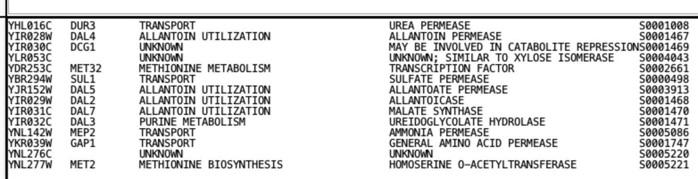
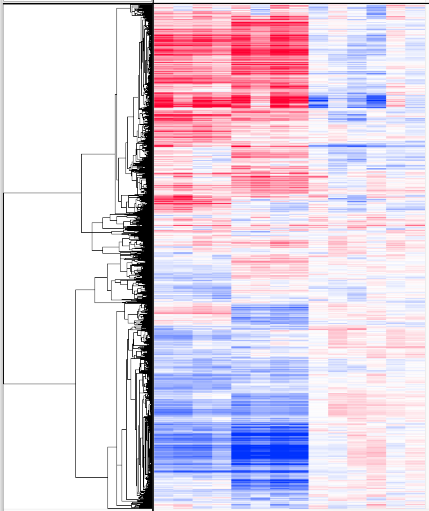
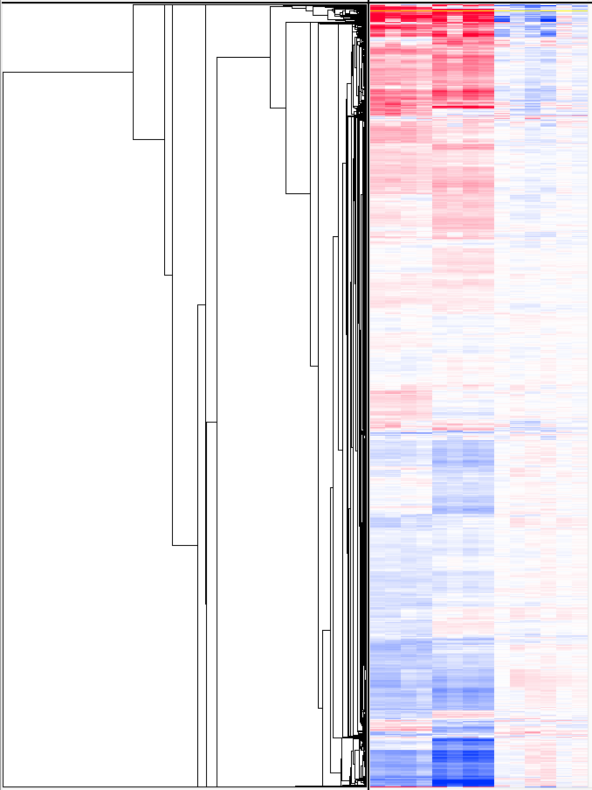
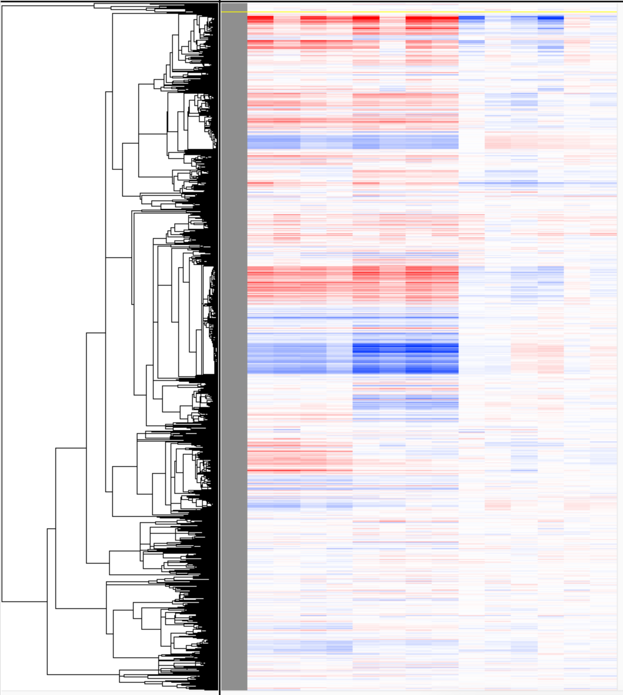

last updated: `r Sys.Date()`

# Description

This activity is intended to familiarize you with hierarchical clustering using Cluster 3.0 and visualization using Java TreeView.

# Learning outcomes

At the end of this exercise, you should be able to:

-   Create a preclustering (PCL) file to load into Cluster 3.0.
-   Perform hierarchical clustering with different settings.
-   Visualize clustered data with TreeView
-   Generate gene lists for clusters of interest for downstream functional analysis (e.g., GO enrichment)

# Cluster 3.0

There are lots of software packages that will perform clustering analysis. One of the original programs for hierarchical clustering was designed by Michael Eisen, which has been converted to an open source package with the current version of 3.0. Files generated following clustering analysis can be visualized using Java TreeView.

## Generating a PCL file

Cluster reads in tab-delimited text files with a minimum of 1 column with the gene IDs, columns of your expression values (generally logFC, but can be TPMs), and then a row with column names. I also include an extra column with gene annotations and gene weight (GWEIGHT, all set to 1 to start) and experiment weight (EWEIGHT, also set to 1 for all). More on what weights are to follow. To open a PCL file, select from the Cluster drop-down menu "File" -\> "Open Data."

{width="750"}

## Filtering data

Cluster allows filtering on:

-   **% Present \>= X.** Genes with missing values above that cutoff are removed from the analysis.

-   **SD (Gene Vector) \>= X.** Genes with standard deviations above that cutoff are removed from the analysis.

-   **At least X Observations with abs(Val) \>= Y.** Genes with fewer than the selected number of observations above a cutoff are removed from the analysis. E.g., At least 1 observation with a logFC of +/- 1.

-   **MaxVal-MinVal \>= X.** Genes whose maximum minus minimum values are less than the cutoff are removed.

I generally filter on 80% or 100% present, and will often only include significantly differentially expressed genes in my PCL file (instead of applying a specific filter).

{width="500"}

## Hierarchical Clustering

Cluster allows you to perform hierarchical clustering on genes, arrays (i.e., samples/experiments), or both. Check the "Cluster" box for one or both, and then choose your similarity metric. The most common are Pearson correlation (either centered or uncentered) and Euclidian distance. Finally, you click on the linkage type to start the clustering (centroid, single, complete, or average).

By default, all experiments (arrays) are treated equally (set to 1). Sometimes you have more than one type of sample than another (e.g., 6 treatments and 3 controls). This unbalanced design means that the treatment groups will disproportionately influence the clustering. The "Calculate weights" tab reapportions how much each experiment affects the clustering, ideally up-weighting the controls and down-weighting the treatments.

This is implemented through the following equation, where L is the local density score for each row (i):

{width="300"}

The user supplies the exponent value (n) and the cutoff (k). Common values for the cutoff are 0.7 to 1, and 0.4 to 0.8 for the exponent. The clustered data file will show the re-calculated weights, which you can use to refine your weighting choices.

The outputs of Cluster will be a clustered data table (JobName.cdt), and the gene (g) and/or array (a) tree files (JobName.gtr, JobName.atr).

**Make sure your job name is informative (e.g., EtOH_Response_CenteredPearson_CentroidDistance).**

{width="500"}

## *K*-Means Clustering

Cluster also allows for *k*-means clustering, where you can organize genes into *k* clusters using the same similarity metric options as for hierarchical clustering. You can use the following code to estimate the optimal number of clusters via three methods (wss, silhouette, and gap statistic):

```{r}
#| warning: false

if (!require("readr")) install.packages("readr"); library(readr)
if (!require("factoextra")) install.packages("factoextra"); library(factoextra)
if (!require("NbClust")) install.packages("NbClust"); library(NbClust)

# Import From Text (readr) to load the pcl file. 
### Change code below to PCL_file <- read_delim(PATH TO YOUR FILE) ###
# PCL_file <- read_delim("/Users/jeffreylewis/Desktop/Genomic_Analysis_Course/Data/DE_yeast_TF_stress_PLC.pcl", 
#     delim = "\t", escape_double = FALSE, 
#     trim_ws = TRUE)

## Alternate code to load the file from the internet
PCL_file <- readr::read_tsv("https://github.com/clstacy/GenomicAnalysis/raw/main/Data/Msn24_EtOH/clustering/DE_yeast_TF_stress_PCL.pcl",
                            trim_ws = TRUE)


# removing the 3 columns and 1 row that do not contain logFC data
PCL_nbclust = PCL_file[,-c(1,2,3)]
PCL_nbclust = PCL_nbclust[-1,]

# Elbow method
fviz_nbclust(PCL_nbclust, kmeans, method = "wss") +
    geom_vline(xintercept = 4, linetype = 2)+
  labs(subtitle = "Elbow method")

# Silhouette method
fviz_nbclust(PCL_nbclust, kmeans, method = "silhouette")+
  labs(subtitle = "Silhouette method")

# Gap statistic
# nboot = 10 to keep the function speedy.
# recommended value: nboot= 500 for your analysis.
# Use verbose = FALSE to hide computing progression.
set.seed(123)

fviz_nbclust(PCL_nbclust, kmeans, nstart = 25,  
             method = "gap_stat", nboot = 20) +
  labs(subtitle = "Gap statistic method")
```

# Visualizing Clusters with Java TreeView

Treeview uses the cdt file to generate a heat map of the clustered data and the gtr/atr files to draw the tree (similar to a phylogenetic tree). Here's an example heat map.


The large panel in the middle is the heat map of all the data (global), with each row being the expression values for a single gene, and each column being a single experiment/sample. The inset shows a zoomed image for a selected portion of the tree, and those are obtained by clicking on the heat map to select a single gene, and then moving the cursor into the tree region and pressing the "up" arrow on the keyboard to move node-by-node up the tree. On top of the inset heat map are the sample names, and to the right are the gene names and annotations. The far top left shows the correlation value for that particular node the tree.

## Changing pixel settings.

The colors on the heat map are user defined by the pixel settings tab, where you can set the max logFC for the color scheme and change the colors for the positive, negative, and zero values. The default for the global tree is to not show the full scale, but you can set it to "fill" to fit the entire screen.

{width="500"}

## Selecting groups of genes.

When picking out clusters of genes, we often want to know their functional enrichments. We can select groups of genes by clicking on the "Export" tab and then "Save List."

{width="500"}

The resulting list can then be either copy and pasted into Excel or saved directly as a text file. The lists can then be used as inputs for clusterProfiler or online enrichment analysis tools (such as the Princeton Go Finder).

{width="500"}

# Performing clustering on yeast stress data

Now it's your turn to play around with data. Download the `Gasch_2000_stress.pcl` file from OneDrive (`Data Files -> Msn24_EtOH -> Clustering`) and visualize clustering outputs using different methods:

1)  Compare with and without filtering on 80% present, and compare with and without filtering on having a certain number of values above an logFC of \|1\|.

2)  Compare different similarity metrics. The ones most commonly used are (Pearson) correlation (centered or uncentered) and Euclidean difference, but see what clustering with other metrics looks like.

3)  What happens to the heat map and tree look when you use different linkage methods (centroid, single, complete, or average)?

## Questions

1.  Using the `Gasch_2000` dataset, filter the data on 80% present, and then cluster with uncentered correlation, calculated weights on arrays (so click on the box in "Genes") with a cutoff of 0.7 and an exponent of 1, and click centroid linkage.

    *Search for the gene* DCG1 *(a gene of unknown function). Based on the genes immediately surround* DCG1 *in the heat map, what would you predict the function of* DCG1 *to be and why?*

    

<!-- -->

2.  Download the `DE_yeast_TF_stress.txt` dataset from the OneDrive (in the same Clustering folder as for the `Gasch_2000` dataset). These data include logFC and FDR corrected-pvalues for both the NaCl (salt) response and the EtOH response for WT yeast, an *msn2/4∆*∆ deletion mutant (which we've looked at before), and deletion mutants for two other transcription factors, *yap1*∆, and *skn7*∆.

    Create a PCL file combining just the logFC data for the EtOH and NaCl responses for the WT and mutant strains (so, leave out the WT vs mutant comparisons). Cluster the genes using the Correlation (uncentered), which is the uncentered Pearson correlation, and click "Centroid linkage." Save the job with a name that denotes those choices. Then, change the similarity metric to Euclidean distance and repeat the clustering (still Centroid linkage).

    *How does using Euclidean distance affect the clustering and why? When might you want to use Euclidean distance as your similarity metric?*

Euclidean distance clusters by the magnitude of the expression change, while Pearson correlation clusters by the trend of the expression change. You can observe how this looks different by looking at the hierarchical cluster heatmaps. The Euclidean distance clusters map linearly, with the highest positive expression at the top of the tree and the highest negative expression at the bottom of the tree. By contrast, the Pearson correlation clusters map almost radially, with strong bands of positive and negative expression towards the top and bottom of the tree (respectively) and with intensity of expression strongest at the center of the band getting weaker farther from the center of the band.

Pearson correlation is most appropriate to use for experiments that consider time course or developmental program data, while Euclidean distance is most appropriate for data where a small number of conditions is being compared across a single time point.





2.  Repeat the clustering using Absolute correlation (uncentered) and Centroid linkage. How does this affect the clustering and why? Can you think of a circumstance where Absolute correlation would be useful?



2.  Make two new PCL files separating the ethanol responses and salt responses, and cluster the data separately. This time cluster on arrays as well as genes. Try different filters and clustering methods until you find one that you feel captures the data, and note your clustering parameters.

    Based on your clustering, which transcription factor looks to be most responsible for the regulating the ethanol response? Which transcription factors seems most responsible for the salt response? Looking back at the FDR corrected p-values for each TF's response (WT v mutant comparisons), does this match your expectations from the clustering. Why might clustering and differential expression analysis yield different answers to the question of which TF is most important for a response?

3.  Using the clustering that you settled on for question #4, identify the single main cluster for each that contains genes affected by the muations in *msn2/4*. Make a figure highlighting those clusters by exporting the thumbnail images and importing into PowerPoint (or another graphics program if you prefer) and drawing a line next to the clusters (e.g., Figure 4 [from this paper](https://pubmed.ncbi.nlm.nih.gov/32027144/)). Use the [Princeton GO term Finder](https://go.princeton.edu/cgi-bin/GOTermFinder) to identify BP enrichments for those clusters, and annotate the top 5 terms to the figure. Save as a PDF to embed into your homework document.

```{r}
library(dplyr)
library(readr)


data <- read.delim("data/DE_yeast_TF_stress.txt")


data <- data %>%
  mutate(GWEIGHT = 1) %>%
  select(contains(c("id", "name", "gweight", "logFC")))

data <- rbind(c("EWEIGHT", "", "", replicate(ncol(data)-3, 1, simplify = FALSE)), data)

write_delim(data, "data/DE_yeast_TF_stress.pcl", delim = "\t") 
```
